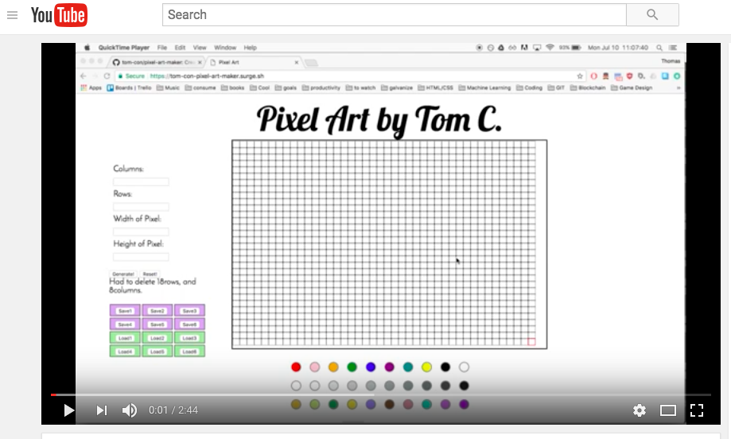

# Pixel Art Maker

A Front-End web app designed for making some cool pixel art!

### Getting Started
Check out the video walkthrough below to see the features of the website:

### Features
- User creates fun pixel art using classic colors or a random selection
- Users can save their designs and later access them again
- Users can change the size of the board or tile using drag and drop, or making a change in the menu

### Technologies used
- Javascript, HTML5, CSS3

### Thanks for stopping by!
If you have any suggestions for improvement please contact me and let me know
